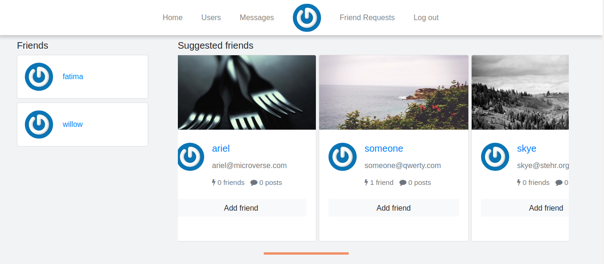
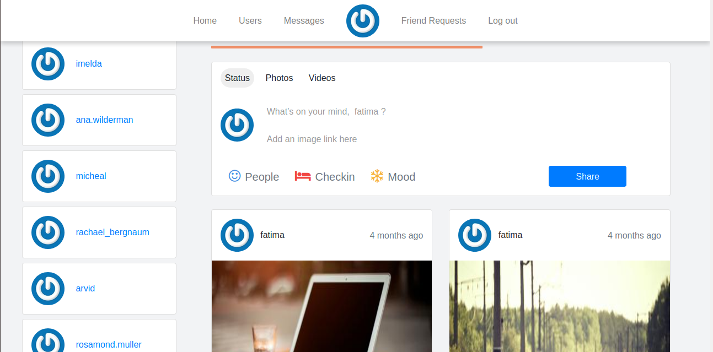

# Facebook_clone

Facebook_clone is a clone of some of the features of the Facebook app.
https://www.facebook.com
## [Live Link](https://morning-falls-89247.herokuapp.com)

## Features

- Users can send friend requests
- Users can receive friend requests
- Users can cancel friend requests
- Users have a facebook like feed where they can view their posts and well as their friend's posts
- Users can create posts with or without images
- Users can view their profile
- Users can comment on and like other posts

## Authors
👤 **Fatima Ahmed**

- Github: [@githubhandle](https://github.com/fatymahmed)
- Twitter: [@twitterhandle](https://twitter.com/fatymahmed)
- Linkedin: [linkedin](https://www.linkedin.com/in/fatimahmed/)
- Email: fatima.ahmed.muhsin@gmail.com

👤 **Shivam Kaushik**

- Github: [@githubhandle](https://github.com/KaushikShivam)
- Twitter: [@twitterhandle](https://twitter.com/kShivamDev)
- Linkedin: [linkedin](https://www.linkedin.com/in/shivam-kaushik-bb8162102/)
- Email shivamkaushikofficial@gmail.com

## Technologies

Ruby

## Framework

Ruby on Rails
Bootstrap

## Requirements

Ruby version 2.6.3

Rails version 5.1.7

## Installation

- Clone this project
- Run `bundle install`
- Run `rails db:migrate`
- Run `Rails s`
- Open `localhost:3000` in your browser
